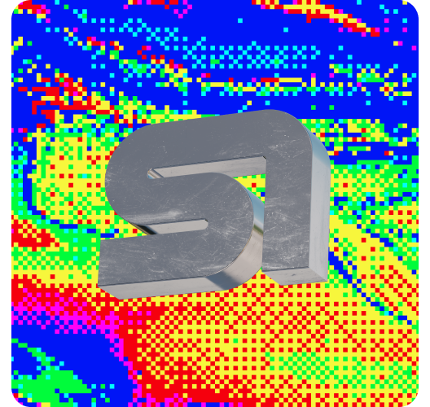
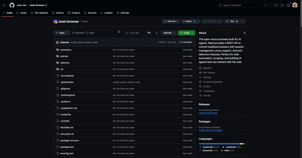

<br />
<p align="center">
<a href="https://steel.dev">
  
</a>
</p>

<h3 align="center"><b>Steel</b></h3>
<p align="center">
    <b>The open-source browser API for AI agents & apps</b>. <br />
    The best way to build live web agents and browser automation tools.
</p>

<p align="center">
  <a href="https://github.com/steel-dev/steel-browser/commits/main" target="_blank">
      
  </a>
  <a href="https://github.com/steel-dev/steel-browser/blob/main/LICENSE" target="_blank">
      
  </a>
  <a href="https://discord.gg/gPpvhNvc5R" target="_blank">
      
  </a>
  <a href="https://twitter.com/steeldotdev" target="_blank">
      
  </a>
  <a href="https://github.com/steel-dev/steel-browser" target="_blank">
      
  </a>
</p>

<h4 align="center">
    <a href="https://app.steel.dev/sign-up" target="_blank">
      Get Started
  </a>  ·
    <a href="https://docs.steel.dev/" target="_blank">
      Documentation
  </a>  ·
  <a href="https://steel.dev/" target="_blank">
      Website
  </a> ·
  <a href="https://github.com/steel-dev/steel-cookbook" target="_blank">
      Cookbook
  </a>
</h4>

<p align="center">
  
</p>

[Steel](https://steel.dev) is an open-source browser API. We make it easy for AI devs to programmatically control browsers that work with your favorite frameworks.

> Steel is in public beta and evolving every day. Your suggestions, ideas, and reported bugs help us immensely. Do not hesitate to join in the conversation on [Discord](https://discord.gg/gPpvhNvc5R) or raise a GitHub issue. We read everything and respond to most.


## ⚡ Installation

The easiest way to get started with Steel is by creating a [Steel Cloud](https://app.steel.dev) account.

| Installation methods | Link                                                                                                                                          |
| -------------------- | ------------------------------------------------------------------------------------------------------------------------------------------------------------ |
| Run locally with GHCR | [](https://github.com/steel-dev/steel-browser/pkgs/container/steel-browser) |
| 1-click deploy to Railway | [](https://railway.app/template/FQG9Ca) |
| 1-click deploy to Render | [](https://render.com/deploy?repo=https://github.com/steel-dev/steel-browser) |


## ✨ Highlights 

The Steel browser provides a REST API to control a headless browser powered by Puppeteer. Under the hood, it manages browser instances, sessions, and pages, allowing you to perform complex browsing tasks programmatically without any of the headaches:

- **Full Browser Control**: Uses Puppeteer and CDP for complete control over Chrome instances -- allowing you to connect using Puppeteer, Playwright, or Selenium.
- **Session Management**: Maintains browser state, cookies, and local storage across requests
- **Proxy Support**: Built-in proxy chain management for IP rotation
- **Extension Support**: Load custom Chrome extensions for enhanced functionality
- **Debugging Tools**: Built-in request logging and session recording capabilities
- **Anti-Detection**: Includes stealth plugins and fingerprint management
- **Resource Management**: Automatic cleanup and browser lifecycle management


For detailed API documentation and examples, check out our [API reference](https://docs.steel.dev/api-reference) or explore the Swagger UI directly at `http://0.0.0.0:3000/documentation`.


## Getting Started

The fastest way to get started is to build and run the Docker image:

```bash
# Clone and build the Docker image
git clone https://github.com/steel-dev/steel-browser
cd steel-browser
docker build -t steel .

# Run the server
docker run -p 3000:3000 -p 5173:5173 -p 9223:9223 steel
```

Alternatively, if you have Node.js and Chrome installed, you can run the server directly:

```bash
npm install
npm run dev
```

This will start the Steel server on port 3000.

Make sure you have the Chrome executable installed and in one of these paths:


- **Linux**:
  `/usr/bin/google-chrome`

- **MacOS**:
  `/Applications/Google Chrome.app/Contents/MacOS/Google Chrome`

- **Windows**:
  - `C:\Program Files\Google\Chrome\Application\chrome.exe` OR
  - `C:\Program Files (x86)\Google\Chrome\Application\chrome.exe`

For more details on where this is checked look at [`src/server/utils/browser.ts`](./src/server/utils/browser.ts).

## Usage
The Steel browser provides a REST API to control a headless browser powered by Puppeteer. Under the hood, it manages browser instances, sessions, and pages, allowing you to perform complex browsing tasks programmatically.

The full REST API documentation can be found on your Steel instance at `/documentation` (e.g., `http://0.0.0.0:3000/documentation`).

Steel provides three main ways to let your agents do browser automation:

### Quick Actions API
The `/scrape`, `/screenshot`, and `/pdf` endpoints let you quickly extract clean, well-formatted data from any webpage using the running Steel server. Ideal for simple, read-only, on-demand jobs:

#### Scrape a Web Page
Extract the HTML content of a web page.
```bash
# Example using the Actions API
curl -X POST http://0.0.0.0:3000/v1/scrape \
  -H "Content-Type: application/json" \
  -d '{
    "url": "https://example.com",
    "waitFor": 1000
  }'
```

### Take a Screenshot
Take a screenshot of a web page.
```bash
# Example using the Actions API
curl -X POST http://0.0.0.0:3000/v1/screenshot \
  -H "Content-Type: application/json" \
  -d '{
    "url": "https://example.com",
    "fullPage": true
  }' --output screenshot.png
```

### Browser Sessions API
The Browser Sessions API lets you relaunch the browser with custom options or extensions (e.g. with a custom proxy) and also reset the browser state. Perfect for complex, stateful workflows that need fine-grained control:

```bash
# Launch a new browser session
curl -X POST http://0.0.0.0:3000/v1/sessions \
  -H "Content-Type: application/json" \
  -d '{
    "options": {
      "proxy": "user:pass@host:port",
      // Custom launch options
    }
  }'
```

### Selenium Integration
>**Note:** This integration does not support all the features of the CDP-based browser sessions API.

For teams with existing Selenium workflows, the Steel browser provides a drop-in replacement that adds enhanced features while maintaining compatibility:

```bash
# Launch a Selenium session
curl -X POST http://0.0.0.0:3000/v1/selenium/launch \
  -H "Content-Type: application/json" \
  -d '{
    "options": {
      // Selenium-compatible options
    }
  }'
```

The Selenium API is fully compatible with Selenium's WebDriver protocol, so you can use any existing Selenium clients to connect to the Steel browser.

```typescript
// Example using the Selenium API
const builder = new Builder()
      .forBrowser("chrome")
      .usingServer(
        `http://0.0.0.0:3000/selenium`
      );

const driver = await builder.build();

console.log("Navigating to Google");
await driver.get("https://www.google.com");

// The rest of your Selenium code here...
```

## Get involved
The Steel browser is an open-source project, and we welcome contributions!
- Questions/ideas/feedback? Come hangout on [Discord](https://discord.gg/gPpvhNvc5R)
- Found a bug? Open an issue on [GitHub](https://github.com/steel-dev/steel-browser/issues)

## License
[Apache 2.0](./LICENSE)
